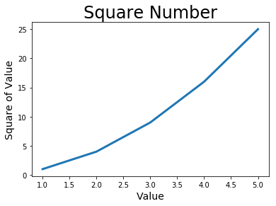
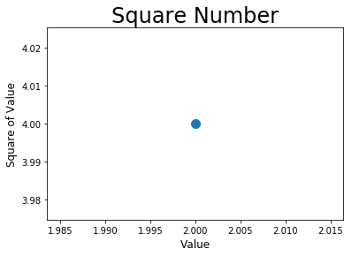
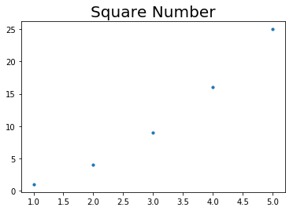
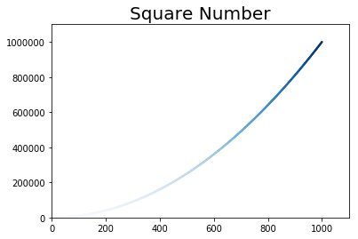
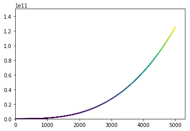

```python
import matplotlib.pyplot as plt

i = [1, 2, 3, 4, 5]
squares = [1, 4, 9, 16, 25]
plt.plot(i, squares, linewidth=3)

plt.title("Square Number", fontsize=24)
plt.xlabel("Value", fontsize=14)
plt.ylabel("Square of Value", fontsize=14)

plt.show()
```





```python
import matplotlib.pyplot as plt

plt.scatter(2, 4, s=100)

plt.title("Square Number", fontsize=24)
plt.xlabel("Value", fontsize=12)
plt.ylabel("Square of Value", fontsize=12)

plt.tick_params(axis='both', which='major', labelsize=10)
plt.show()
```





```python
import matplotlib.pyplot as plt

x_values = [1, 2, 3, 4, 5]
y_values = [1, 4, 9, 16, 25]

plt.scatter(x_values, y_values, s=10)
plt.title("Square Number", fontsize=20)
```


    Text(0.5, 1.0, 'Square Number')





```python
import matplotlib.pyplot as plt

x_values = list(range(1, 1001))
y_values = [x**2 for x in x_values]

plt.scatter(x_values, y_values, c=y_values, cmap=plt.cm.Blues,
                edgecolor='none', s=5)
plt.title("Square Number", fontsize= 20)

plt.axis([0, 1100, 0, 1100000])
```


    [0, 1100, 0, 1100000]





```python
import matplotlib.pyplot as plt

x_values = list(range(1, 5001))
y_values = [x**3 for x in x_values]

plt.scatter(x_values, y_values, edgecolor='none', c=y_values, s=3)
plt.axis([0, 5300, 0, 150000000000])


```


    [0, 5300, 0, 150000000000]




