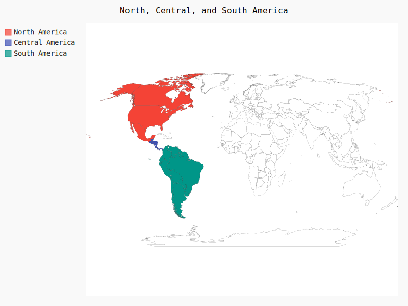
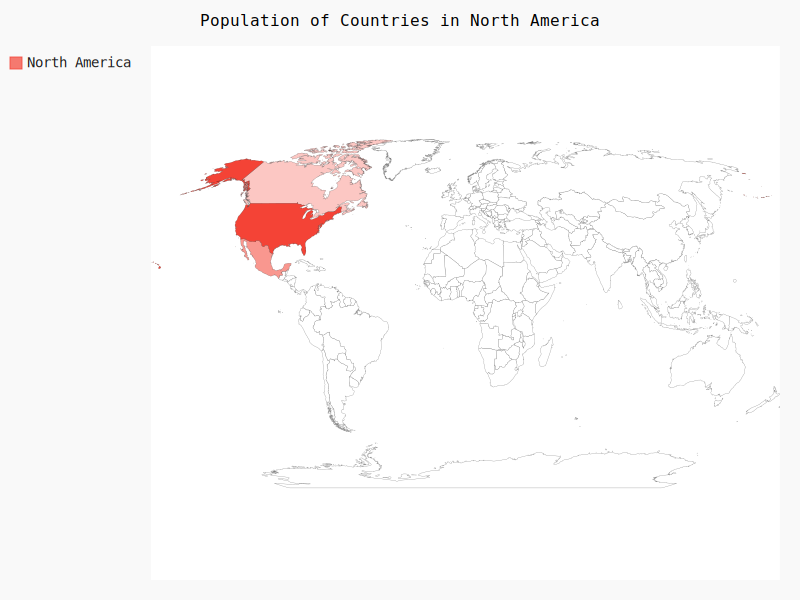
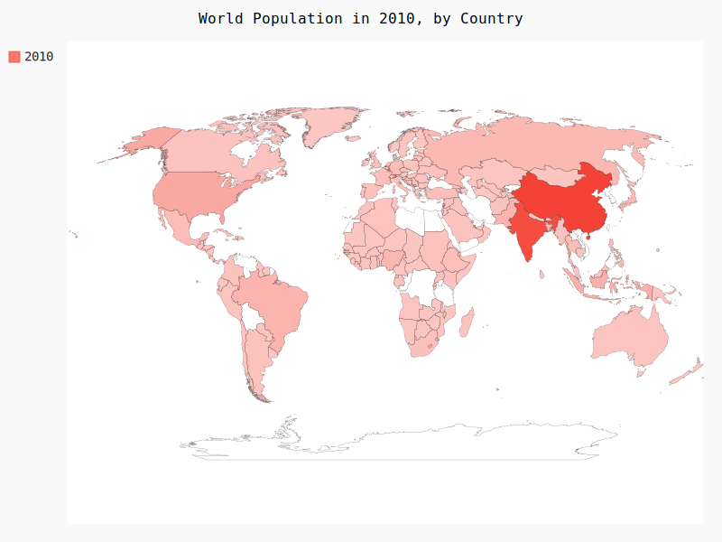

```python
   
    import pygal

    wm = pygal.maps.world.World()
    wm.title = 'North, Central, and South America'

    wm.add('North America', ['ca', 'mx', 'us'])
    wm.add('Central America', ['bz', 'cr', 'gt', 'hn', 'ni', 'pa', 'sv'])
    wm.add('South America', ['ar', 'bo', 'br', 'cl', 'co', 'ec', 'gf',
                         'gy', 'pe', 'py', 'sr', 'uy', 've'])

    wm.render_to_file('americas.svg')
```



```python
   import pygal

   wm = pygal.maps.world.World()
   wm.title = 'Population of Countries in North America'
   wm.add('North America', {'ca': 3412600, 'us': 309349000, 'mx': 113423000})
   wm.render_to_file('na_popuplations.svg')

```


```python
   import json
   import pygal
   from country_codes import get_country_code

   filename = 'population_data.json'
   with open(filename) as f:
       pop_data = json.load(f)

   cc_populations = {}
   for pop_dict in pop_data:
      if pop_dict['Year'] == '2010':
           country_name = pop_dict['Country Name']
          population = int(float(pop_dict['Value']))
          code = get_country_code(country_name)
           if code:
              cc_populations[code] = population
            
   wm = pygal.maps.world.World()
   wm.title = 'World Population in 2010, by Country'
   wm.add('2010', cc_populations)

   wm.render_to_file('world_population.svg')
```

